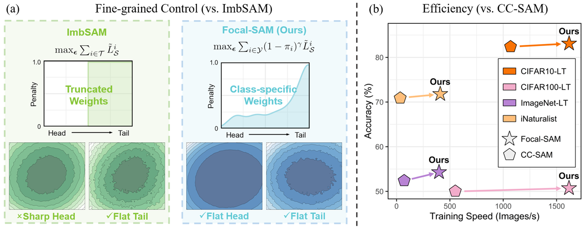

# DirMixE


This repository is the official code for the paper [Focal-SAM: Focal Sharpness-Aware Minimization for Long-Tailed Classification](https://arxiv.org/abs/2505.01660) (ICML 2025).


**Paper Title: Focal-SAM: Focal Sharpness-Aware Minimization for Long-Tailed Classification.**

**Author: Sicong Li, [Qianqian Xu\*](https://qianqianxu010.github.io/), [Zhiyong Yang](https://joshuaas.github.io/),  [Zitai Wang](https://wang22ti.com/), Linchao Zhang, [Xiaochun Cao](https://scst.sysu.edu.cn/members/1401493.htm), [Qingming Huang\*](https://people.ucas.ac.cn/~qmhuang)**


> Abstract: Real-world datasets often follow a long-tailed distribution, making generalization to tail classes difficult. Recent methods resorted to long-tail variants of Sharpness-Aware Minimization (SAM), such as ImbSAM and CC-SAM, to improve generalization by flattening the loss landscape. However, these attempts face a trade-off between computational efficiency and control over the loss landscape. On the one hand, ImbSAM is efficient but offers only coarse control as it excludes head classes from the SAM process. On the other hand,  CC-SAM provides fine-grained control through class-dependent perturbations but at the cost of efficiency due to multiple backpropagations. Seeing this dilemma, we introduce Focal-SAM, which assigns different penalties to class-wise sharpness, achieving fine-grained control without extra backpropagations, thus maintaining efficiency. Furthermore, we theoretically analyze Focal-SAM's generalization ability and derive a sharper generalization bound. Extensive experiments on both traditional and foundation models validate the effectiveness of Focal-SAM.


[](figs/method.png)


## Installation


- Clone the repository

```
git clone https://github.com/scongl/Focal-SAM.git
```


- Install the required libraries

```
pip install -r requirements.txt
```


## Datasets


### Four bechmark datasets


- Please download these datasets and put them to the /data file.
- ImageNet-LT can be found at [here](https://drive.google.com/drive/u/1/folders/1j7Nkfe6ZhzKFXePHdsseeeGI877Xu1yf).
- iNaturalist data should be the 2018 version from [here](https://github.com/visipedia/inat_comp).
- CIFAR-100 and CIFAR-10 will be downloaded automatically with the dataloader.

```
data
├── CIFAR-10
│   └── cifar-10-batches-py
├── CIFAR-100
│   └── cifar-100-python
├── ImageNet_LT
│   ├── test
│   ├── train
│   └── val
└── iNaturalist
    ├── test2018
    └── train_val2018
```


### Txt files


- We provide text files containing the dataset splits for ImageNet-LT and iNaturalist 2018. 

```
data_txt
├── ImageNet_LT
│   ├── classnames.txt
│   ├── ImageNet_LT_test.txt
│   ├── ImageNet_LT_train.txt
│   ├── ImageNet_LT_uniform.txt
│   └── ImageNet_LT_val.txt
└── iNaturalist18
    ├── categories.json
    ├── iNaturalist18_train.txt
    ├── iNaturalist18_uniform.txt
    └── iNaturalist18_val.txt
```


## Script

Pleas refer to the files in the `scripts` folder to run the code.


## Citation


If you find our work inspiring or use our codebase in your research, please cite our work.

```
@inproceedings{li2025focal,
    title={Focal-SAM: Focal Sharpness-Aware Minimization for Long-Tailed Classification}, 
    author={Sicong Li and Qianqian Xu and Zhiyong Yang and Zitai Wang and Linchao Zhang and Xiaochun Cao and Qingming Huang},
    booktitle={International Conference on Machine Learning},
    year={2025}
}
```


## Acknowledgements


Our codes are based on the repository [Saddle-LongTail](https://github.com/val-iisc/Saddle-LongTail).